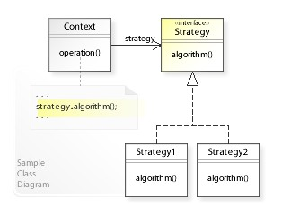

# Strategy Design Patterns

The Strategy Design Patterns defines a `family of algorithms` `encapsulates each one` 
and `makes them interchangeable`.

* Problem with `Inheritance`
    * Hard to gain knowledge of all the behavior of a Class.
    * Sub-Classes can have different behavior.
    Adding new behavior in the Parent-class can unintentionally affect other sub-Classes.
    * Forces introducing new sub-Classes with new requirements (for example introducing different behaviors).
* Problem with `Interface`
    * 
    

# Resource
* [The strategy pattern explained using java](https://www.freecodecamp.org/news/the-strategy-pattern-explained-using-java-bc30542204e0)
* [Strategy Pattern - Design Patterns (ep 1)](https://www.youtube.com/watch?v=v9ejT8FO-7I&list=PLrhzvIcii6GNjpARdnO4ueTUAVR9eMBpc&index=1)